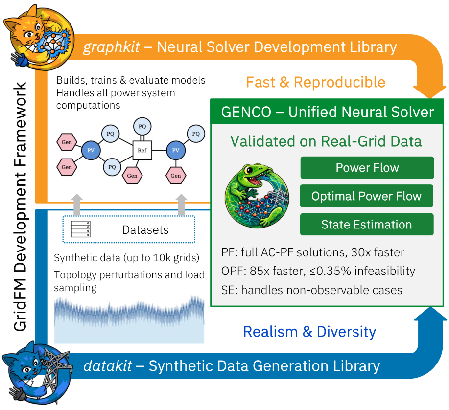

# GENCO - A Unified Neural Solver Embedded in a Development Framework for Steady-State Grid Analysis

These are step-by-step guides for reproducing the results of [GENCO — A Unified Neural Solver Embedded in a Development Framework for Steady-State Grid Analysis](https://arxiv.org/abs/2608.09921) (arXiv:2608.09921).



## What is in this repo

This repo is the paper and the reproduction guides. The training code, datasets, and checkpoints are not stored here. Each guide links to the GitHub branch and the Hugging Face repos that hold them.

- [`paper/`](paper/) is the LaTeX source of the paper, including the figures and tables.
- [`repro_instructions/`](repro_instructions/) is one guide per result section. A guide says where the numbers are, how the data was built, how the model was trained, how to reuse the saved checkpoint, and which script rebuilds the figure or table.


| Guide |
| --- |
| [5.1 Power flow on PFΔ](repro_instructions/5.1_PF_on_pfdelta.md) |
| [5.2 Optimal power flow on OPFData](repro_instructions/5.2_OPF_on_opfdata.md) |
| [5.4.2 Power flow on datakit](repro_instructions/5.4.2_PF_on_datakit.md) |
| [5.4.3 Optimal power flow on datakit](repro_instructions/5.4.3_OPF_on_datakit.md) |
| [5.4 Runtime (GENCO)](repro_instructions/5.4.2-3_Runtime_genco.md) |
| [5.4 Runtime (PowerModels)](repro_instructions/5.4.2-3_Runtime_powermodels.md) |
| [5.5.1 Topology perturbations](repro_instructions/5.5.1_PF_on_texas_contingency.md) |
| [5.5.2 Out-of-limit operating points](repro_instructions/5.5.2_PF_on_texas_limits.md) |
| [5.5.3 Transfer to unseen grids](repro_instructions/5.5.3_PF_transfer.md) |

## Cite

```bibtex
@article{puech2026gencounifiedneural,
  title={GENCO - A Unified Neural Solver Embedded in a Development Framework for Steady-State Grid Analysis},
  author={Alban Puech and Matteo Mazzonelli and Tamara R. Govindasamy and Mangaliso Mngomezulu and Héctor Maeso-García and Thomas Tolhurst and Javad Bayazi and Ali Moeini and Naomi Simumba and Celia Cintas and David Nelischer and Romeo Kienzler and Jonas Weiss and Anna Varbella and Florian Dörfler and Gabriela Hug and Martin Mevissen and Juan Bernabé-Moreno and François Mirallès and Hendrik F. Hamann and Etienne Vos and Thomas Brunschwiler},
  journal={arXiv preprint arXiv:2608.09921},
  year={2026},
  url={https://arxiv.org/abs/2608.09921}
}
```

